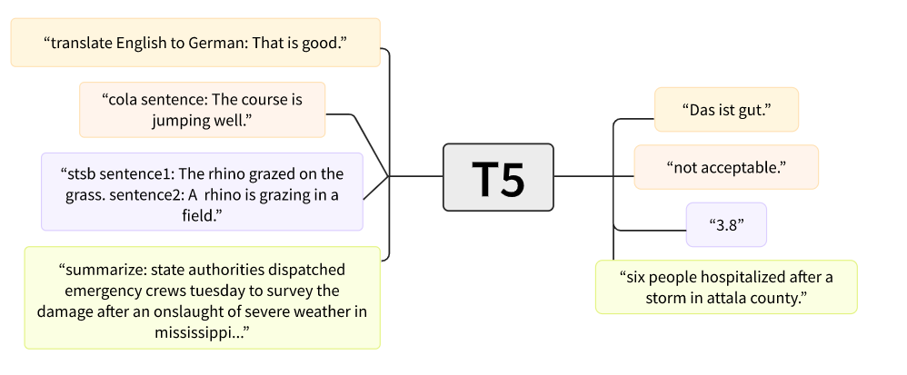

[Summarization - Hugging Face Course](https://huggingface.co/learn/nlp-course/chapter7/5?fw=pt)




mT5不使用前缀，但分享了T5的大部分通用性，并具有多语言的优势。现在我们已经选择了一个模型，让我们来看看如何准备我们的数据进行训练。

```python
from datasets import load_dataset

chinese_dataset = load_dataset("amazon_reviews_multi", "zh")
def filter_books(example):
    return (
        example["product_category"] == "book"
        or example["product_category"] == "digital_ebook_purchase"
    )

chinese_books = chinese_dataset.filter(filter_books)
from transformers import AutoTokenizer

model_checkpoint = "google/mt5-small"
tokenizer = AutoTokenizer.from_pretrained(model_checkpoint)

max_input_length = 512
max_target_length = 30


def preprocess_function(examples):
    model_inputs = tokenizer(
        examples["review_body"],
        max_length=max_input_length,
        truncation=True,
    )
    labels = tokenizer(
        examples["review_title"], max_length=max_target_length, truncation=True
    )
    model_inputs["labels"] = labels["input_ids"]
    return model_inputs

books_dataset = chinese_dataset
tokenized_datasets = books_dataset.map(preprocess_function, batched=True).remove_columns(['review_id', 'product_id', 'reviewer_id', 'stars', 'review_body', 'review_title', 'language', 'product_category'])
import nltk
nltk.download('stopwords')
nltk.download('punkt')
from nltk.tokenize import sent_tokenize
from rouge_chinese import Rouge as RougeChinese
import numpy as np

tokenized_datasets["train"] = tokenized_datasets["train"].select(range(2000))
tokenized_datasets["validation"] = tokenized_datasets["validation"].select(range(200))


rouge_score = RougeChinese()
def compute_metrics(eval_pred):
    predictions, labels = eval_pred
    # Decode generated summaries into text
    decoded_preds = tokenizer.batch_decode(predictions, skip_special_tokens=True)
    # Replace -100 in the labels as we can't decode them
    labels = np.where(labels != -100, labels, tokenizer.pad_token_id)
    # Decode reference summaries into text
    decoded_labels = tokenizer.batch_decode(labels, skip_special_tokens=True)
    # ROUGE expects a newline after each sentence
    decoded_preds = ["\n".join(sent_tokenize(pred.strip())) for pred in decoded_preds]
    decoded_labels = ["\n".join(sent_tokenize(label.strip())) for label in decoded_labels]
    # Compute ROUGE scores
    result = rouge_score.get_scores(hyps=decoded_preds, refs=decoded_labels, avg=True)
    # Extract the median scores
    result = {key: value['f'] * 100 for key, value in result.items()}
    print(result)
    return {k: round(v, 4) for k, v in result.items()}

from transformers import Seq2SeqTrainingArguments

batch_size = 8
num_train_epochs = 8
# Show the training loss with every epoch
logging_steps = len(tokenized_datasets["train"]) // batch_size
model_name = model_checkpoint.split("/")[-1]
from transformers import AutoModelForSeq2SeqLM
model = AutoModelForSeq2SeqLM.from_pretrained(model_checkpoint)

args = Seq2SeqTrainingArguments(
    output_dir=f"{model_name}-finetuned-amazon-zh",
    evaluation_strategy="epoch",
    save_strategy="epoch",
    learning_rate=5.6e-5,
    per_device_train_batch_size=batch_size,
    per_device_eval_batch_size=batch_size,
    weight_decay=0.01,
    save_total_limit=3,
    num_train_epochs=num_train_epochs,
    predict_with_generate=True,
    logging_steps=logging_steps,
    push_to_hub=False,
)

from transformers import DataCollatorForSeq2Seq

data_collator = DataCollatorForSeq2Seq(tokenizer, model=model)

from transformers import Seq2SeqTrainer

trainer = Seq2SeqTrainer(
    model,
    args,
    train_dataset=tokenized_datasets["train"],
    eval_dataset=tokenized_datasets["validation"],
    data_collator=data_collator,
    tokenizer=tokenizer,
    compute_metrics=compute_metrics,
)

trainer.train()

trainer.evaluate()
```

评价指标的计算好像还有点问题。预测：

```python
from transformers import pipeline

hub_model_id = "mt5-small-finetuned-amazon-zh/checkpoint-2000"
summarizer = pipeline("summarization", model=hub_model_id)

def print_summary(idx):
    review = books_dataset["test"][idx]["review_body"]
    title = books_dataset["test"][idx]["review_title"]
    summary = summarizer(books_dataset["test"][idx]["review_body"])[0]["summary_text"]
    print(f"'>>> Review: {review}'")
    print(f"\n'>>> Title: {title}'")
    print(f"\n'>>> Summary: {summary}'")

import random
idx = random.choice(range(100))
print_summary(idx)
"""
'>>> Review: 之前的快递非常好，现在的全峰快递非常差，不会在亚马逊再买书了，我没年在亚马逊买500左右的书，下次换别家，卖书的地方多着呢！京东快递是最令人满意的！'
'>>> Title: 之前的快递非常好，现在的全峰快递非常差，不会在亚马逊再买书了。'
'>>> Summary: 快递非常差'
"""
```

使用自定义的训练：

```python
```

