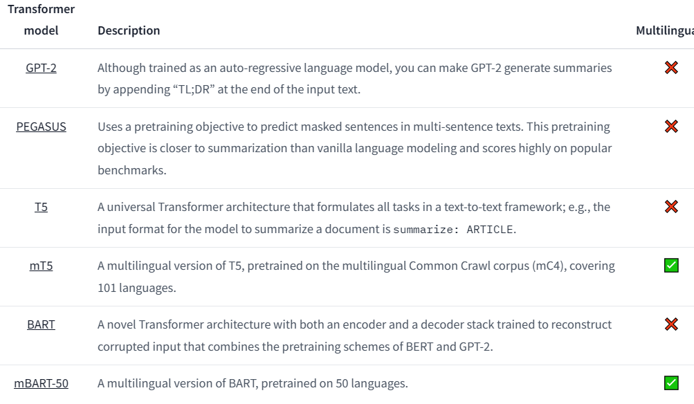

[Summarization - Hugging Face Course](https://huggingface.co/learn/nlp-course/chapter7/5?fw=pt)




mT5不使用前缀，但分享了T5的大部分通用性，并具有多语言的优势。现在我们已经选择了一个模型，让我们来看看如何准备我们的数据进行训练。

```python
from datasets import load_dataset

chinese_dataset = load_dataset("amazon_reviews_multi", "zh")
def filter_books(example):
    return (
        example["product_category"] == "book"
        or example["product_category"] == "digital_ebook_purchase"
    )

chinese_books = chinese_dataset.filter(filter_books)
from transformers import AutoTokenizer

model_checkpoint = "google/mt5-small"
tokenizer = AutoTokenizer.from_pretrained(model_checkpoint)

max_input_length = 512
max_target_length = 30


def preprocess_function(examples):
    model_inputs = tokenizer(
        examples["review_body"],
        max_length=max_input_length,
        truncation=True,
    )
    labels = tokenizer(
        examples["review_title"], max_length=max_target_length, truncation=True
    )
    model_inputs["labels"] = labels["input_ids"]
    return model_inputs

books_dataset = chinese_dataset
tokenized_datasets = books_dataset.map(preprocess_function, batched=True).remove_columns(['review_id', 'product_id', 'reviewer_id', 'stars', 'review_body', 'review_title', 'language', 'product_category'])
import nltk
nltk.download('stopwords')
nltk.download('punkt')
from nltk.tokenize import sent_tokenize
from rouge_chinese import Rouge as RougeChinese
import numpy as np

tokenized_datasets["train"] = tokenized_datasets["train"].select(range(2000))
tokenized_datasets["validation"] = tokenized_datasets["validation"].select(range(200))


rouge_score = RougeChinese()
def compute_metrics(eval_pred):
    predictions, labels = eval_pred
    # Decode generated summaries into text
    decoded_preds = tokenizer.batch_decode(predictions, skip_special_tokens=True)
    # Replace -100 in the labels as we can't decode them
    labels = np.where(labels != -100, labels, tokenizer.pad_token_id)
    # Decode reference summaries into text
    decoded_labels = tokenizer.batch_decode(labels, skip_special_tokens=True)
    # ROUGE expects a newline after each sentence
    decoded_preds = ["\n".join(sent_tokenize(pred.strip())) for pred in decoded_preds]
    decoded_labels = ["\n".join(sent_tokenize(label.strip())) for label in decoded_labels]
    # Compute ROUGE scores
    result = rouge_score.get_scores(hyps=decoded_preds, refs=decoded_labels, avg=True)
    # Extract the median scores
    result = {key: value['f'] * 100 for key, value in result.items()}
    print(result)
    return {k: round(v, 4) for k, v in result.items()}

from transformers import Seq2SeqTrainingArguments

batch_size = 8
num_train_epochs = 8
# Show the training loss with every epoch
logging_steps = len(tokenized_datasets["train"]) // batch_size
model_name = model_checkpoint.split("/")[-1]
from transformers import AutoModelForSeq2SeqLM
model = AutoModelForSeq2SeqLM.from_pretrained(model_checkpoint)

args = Seq2SeqTrainingArguments(
    output_dir=f"{model_name}-finetuned-amazon-zh",
    evaluation_strategy="epoch",
    save_strategy="epoch",
    learning_rate=5.6e-5,
    per_device_train_batch_size=batch_size,
    per_device_eval_batch_size=batch_size,
    weight_decay=0.01,
    save_total_limit=3,
    num_train_epochs=num_train_epochs,
    predict_with_generate=True,
    logging_steps=logging_steps,
    push_to_hub=False,
)

from transformers import DataCollatorForSeq2Seq

data_collator = DataCollatorForSeq2Seq(tokenizer, model=model)

from transformers import Seq2SeqTrainer

trainer = Seq2SeqTrainer(
    model,
    args,
    train_dataset=tokenized_datasets["train"],
    eval_dataset=tokenized_datasets["validation"],
    data_collator=data_collator,
    tokenizer=tokenizer,
    compute_metrics=compute_metrics,
)

trainer.train()

trainer.evaluate()
```

评价指标的计算好像还有点问题。预测：

```python
from transformers import pipeline

hub_model_id = "mt5-small-finetuned-amazon-zh/checkpoint-2000"
model = AutoModelForSeq2SeqLM.from_pretrained(hub_model_id)
summarizer = pipeline("summarization", model=hub_model_id)

def print_summary(idx):
    review = books_dataset["test"][idx]["review_body"]
    title = books_dataset["test"][idx]["review_title"]
    summary = summarizer(books_dataset["test"][idx]["review_body"])[0]["summary_text"]
    print(f"'>>> Review: {review}'")
    print(f"\n'>>> Title: {title}'")
    print(f"\n'>>> Summary: {summary}'")

import random
idx = random.choice(range(100))
print_summary(idx)
"""
'>>> Review: 之前的快递非常好，现在的全峰快递非常差，不会在亚马逊再买书了，我没年在亚马逊买500左右的书，下次换别家，卖书的地方多着呢！京东快递是最令人满意的！'
'>>> Title: 之前的快递非常好，现在的全峰快递非常差，不会在亚马逊再买书了。'
'>>> Summary: 快递非常差'
"""
```

使用自定义的训练：学习率很重要，不然难以得到好的结果。

```python
from datasets import load_dataset

chinese_dataset = load_dataset("amazon_reviews_multi", "zh")
def filter_books(example):
    return (
        example["product_category"] == "book"
        or example["product_category"] == "digital_ebook_purchase"
    )

chinese_books = chinese_dataset.filter(filter_books)
from transformers import AutoTokenizer, AutoModelForSeq2SeqLM

model_checkpoint = "google/mt5-small"
tokenizer = AutoTokenizer.from_pretrained(model_checkpoint)

max_input_length = 512
max_target_length = 30


def preprocess_function(examples):
    model_inputs = tokenizer(
        examples["review_body"],
        max_length=max_input_length,
        truncation=True,
    )
    labels = tokenizer(
        examples["review_title"], max_length=max_target_length, truncation=True
    )
    model_inputs["labels"] = labels["input_ids"]
    return model_inputs

books_dataset = chinese_dataset
tokenized_datasets = books_dataset.map(preprocess_function, batched=True).remove_columns(['review_id', 'product_id', 'reviewer_id', 'stars', 'review_body', 'review_title', 'language', 'product_category'])


tokenized_datasets["train"] = tokenized_datasets["train"].select(range(2000))
tokenized_datasets["validation"] = tokenized_datasets["validation"].select(range(200))

# print(tokenizer.decode(tokenized_datasets["train"][1]["input_ids"]))
# print(tokenizer.decode(tokenized_datasets["train"][1]["labels"]))


import nltk
nltk.download('stopwords')
nltk.download('punkt')
from nltk.tokenize import sent_tokenize
from rouge_chinese import Rouge as RougeChinese
import numpy as np

rouge_score = RougeChinese()


model = AutoModelForSeq2SeqLM.from_pretrained(model_checkpoint)
from torch.utils.data import DataLoader

from transformers import DataCollatorForSeq2Seq

data_collator = DataCollatorForSeq2Seq(tokenizer, model=model)
batch_size = 8
train_dataloader = DataLoader(
    tokenized_datasets["train"],
    shuffle=True,
    collate_fn=data_collator,
    batch_size=batch_size,
)
eval_dataloader = DataLoader(
    tokenized_datasets["validation"], collate_fn=data_collator, batch_size=batch_size
)

# 数据是没有错的
# for batch in eval_dataloader:
#   print(tokenizer.decode(batch["input_ids"][0,:]))
#   labels = batch["labels"][0]
#   labels = np.where(labels != -100, labels, tokenizer.pad_token_id)
#   print(tokenizer.decode(labels, skip_special_tokens=True))
#   break

from torch.optim import AdamW, Adam

optimizer = Adam(model.parameters(), lr=5.6e-6)

from accelerate import Accelerator

accelerator = Accelerator()
model, optimizer, train_dataloader, eval_dataloader = accelerator.prepare(
    model, optimizer, train_dataloader, eval_dataloader
)

from transformers import get_scheduler

num_train_epochs = 8
num_update_steps_per_epoch = len(train_dataloader)
num_training_steps = num_train_epochs * num_update_steps_per_epoch

lr_scheduler = get_scheduler(
    "linear",
    optimizer=optimizer,
    num_warmup_steps=0,
    num_training_steps=num_training_steps,
)

from tqdm.auto import tqdm
import torch
import numpy as np
import os

progress_bar = tqdm(range(num_training_steps))


def postprocess_text(preds, labels):
    preds = [pred.strip() for pred in preds]
    labels = [label.strip() for label in labels]

    # ROUGE expects a newline after each sentence
    preds = ["\n".join(nltk.sent_tokenize(pred)) for pred in preds]
    labels = ["\n".join(nltk.sent_tokenize(label)) for label in labels]

    return preds, labels
output_dir = "mt5"

for epoch in range(num_train_epochs):
    # Training
    model.train()
    for step, batch in enumerate(train_dataloader):
        outputs = model(**batch)
        loss = outputs.loss
        accelerator.backward(loss)

        optimizer.step()
        lr_scheduler.step()
        optimizer.zero_grad()
        progress_bar.update(1)

    # Evaluation
    model.eval()
    predictions = []
    references = []
    for step, batch in enumerate(eval_dataloader):
        with torch.no_grad():
            generated_tokens = accelerator.unwrap_model(model).generate(
                batch["input_ids"],
                attention_mask=batch["attention_mask"],
            )
            
            generated_tokens = accelerator.pad_across_processes(
                generated_tokens, dim=1, pad_index=tokenizer.pad_token_id
            )
            labels = batch["labels"]

            # If we did not pad to max length, we need to pad the labels too
            labels = accelerator.pad_across_processes(
                batch["labels"], dim=1, pad_index=tokenizer.pad_token_id
            )

            generated_tokens = accelerator.gather(generated_tokens).cpu().numpy()
            labels = accelerator.gather(labels).cpu().numpy()

            # Replace -100 in the labels as we can't decode them
            labels = np.where(labels != -100, labels, tokenizer.pad_token_id)
            if isinstance(generated_tokens, tuple):
                generated_tokens = generated_tokens[0]
            decoded_preds = tokenizer.batch_decode(
                generated_tokens, skip_special_tokens=True
            )
            decoded_labels = tokenizer.batch_decode(labels, skip_special_tokens=True)
            print(decoded_preds[0])
            print(decoded_labels[0])
            print("="*50)
            decoded_preds, decoded_labels = postprocess_text(
                decoded_preds, decoded_labels
            )

            predictions.extend(decoded_preds)
            references.extend(decoded_labels)

    # Compute metrics
    result = rouge_score.get_scores(hyps=predictions, refs=references, avg=True)
    # Extract the median scores
    result = {key: value['f'] * 100 for key, value in result.items()}
    print(f"Epoch {epoch}:", result)

    # Save and upload
    accelerator.wait_for_everyone()
    unwrapped_model = accelerator.unwrap_model(model)
    unwrapped_model.save_pretrained(os.path.join(output_dir, f"epoch-{epoch}"), save_function=accelerator.save)
    if accelerator.is_main_process:
        tokenizer.save_pretrained(os.path.join(output_dir, f"epoch-{epoch}"))

```

> [Generating from mT5 · Issue #8704 · huggingface/transformers (github.com)](https://github.com/huggingface/transformers/issues/8704)